# class-doc SQLite 스키마 설계

`better-sqlite3` 기반, 단일 로컬 파일 DB(`class-doc.sqlite` 등, 경로는 `src/main/db/`가
결정). 클라우드/인증/멀티테넌시 없음 — 교사 1인이 자기 PC에서 쓰는 오프라인 앱이며,
전교생 수백 명 규모를 넘지 않는다. 따라서 이 설계는 애플리케이션 코드가 아니라
SQLite DDL(`CHECK`/`UNIQUE`/`FOREIGN KEY ... ON DELETE`)에 최대한 제약을 밀어넣는 것을
원칙으로 한다.

> **개정 이력(v2)**: 교사 피드백 — "csv형식을 지정하기 보다는 그냥 csv필드를 감지해서
> 저장되어야 할거 같은데" — 에 따라 `student`의 고정 컬럼(학년/반/번호/이름/보호자이름)
> 설계를 폐기하고, `template`/`template_field`에 이미 적용된 "필드 먼저 감지, 의미는
> 나중에 매핑" 철학을 학생 데이터에도 동일하게 적용한 EAV(Entity-Attribute-Value)
> 구조로 전면 수정했다. `teacher`/`student_group`/`template`/`template_field`(구조)/
> `generation_run`/`document_history`는 v1에서 그대로 유지되며, `template_field.binding`
> 은 더 이상 닫힌 CHECK enum이 아니다(§4 참고).
>
> **개정 이력(v3)**: §4에서 "템플릿 1개당 매핑 1세트"로 명시적으로 결정하고 §7에
> YAGNI로 보류해뒀던 그룹별 매핑 오버라이드를, 개발자가 실사용 중 명시적으로 뒤집기로
> 결정했다. 서로 다른 그룹의 `group_field` 세트가 서로 다른 필드명 관례를 쓸 수 있다는
> 것이 실제로 확인됐기 때문이다(예: 한 그룹은 "이름", 다른 그룹은 "성명") — 템플릿
> 하나를 필드명이 다른 그룹에 재사용할 때마다 매핑을 매번 처음부터 다시 해야 하는
> 문제가 실사용에서 드러났다. `template_field`의 컬럼/의미는 변경하지 않고("템플릿
> 자체가 기본으로 갖는 매핑"이라는 의미는 그대로 유지, 매핑을 아직 하지 않은 그룹의
> 폴백으로 계속 쓰인다), §4가 미리 문서화해둔 확장 지점 그대로
> `template_field_override(template_field_id, group_id, binding, required,
> default_value)` 테이블을 추가해 (템플릿, 그룹) 쌍 단위로 매핑을 오버라이드할 수
> 있게 했다. 자세한 이유와 트레이드오프는 §4 "설계 결정(v3로 개정)" 참고.

> **연결 시 필수**: better-sqlite3는 연결마다 외래키 강제를 별도로 켜야 한다.
> DB 모듈 초기화 시 매번 다음을 실행할 것.
> ```js
> const db = new Database(dbPath)
> db.pragma('foreign_keys = ON')
> ```

## 1. 엔티티 개요 — 사용자 흐름과의 매핑

| 흐름 단계 | 관련 테이블 |
|---|---|
| ① 교사가 자기 이름 등록, 그룹(들) 등록 | `teacher`, `student_group` |
| ② CSV 헤더에서 필드를 감지해 그룹별로 저장, 재업로드 시 업서트 | `group_field`(감지된 컬럼 정의) + `student` + `student_field_value` |
| ②' 학생을 폼으로 1명씩 추가/수정(CSV 없이) | 위와 동일한 3개 테이블 재사용 — 새 테이블 불필요(§4 참고) |
| ③ 템플릿을 `@rhwp/editor`로 편집·저장 → `<exe 경로>/class-doc/template/`에 저장 → 목록 표시 | `template` |
| ④ `@rhwp/core.getFieldList()`로 누름틀 추출 → 필드 목록 저장 | `template_field` |
| ⑤ 템플릿 선택 → 그룹 선택 → 필드↔데이터(그룹의 동적 필드 또는 정적 값) 매핑, (템플릿,그룹) 쌍마다 별도 저장 | `template_field`(템플릿 기본값/폴백) + `template_field_override`((템플릿,그룹) 쌍별 오버라이드, v3) |
| ⑥ 학생별/목록별 일괄 생성, 성공/실패·오류 메시지 기록 | `generation_run`(배치 헤더) + `document_history`(개별 결과) |

**10개 테이블**: `teacher`, `student_group`, `group_field`, `student`,
`student_field_value`, `template`, `template_field`, `template_field_override`,
`generation_run`, `document_history`.

`template`/`template_field`는 `.claude/skills/rhwp/references/arcjotectire.md`에 문서화된,
실제 `@rhwp/core` 테스트로 검증된 구조(`binding`/`scope`/`UNIQUE(template_id, field_name,
scope)`)를 그대로 재사용한다(§4). `group`은 SQL 예약어라 컬럼/테이블명 충돌을 피하려
`student_group`으로 명명했다.

## 2. ER 다이어그램

```mermaid
erDiagram
    TEACHER ||--o{ STUDENT_GROUP : manages
    STUDENT_GROUP ||--o{ GROUP_FIELD : defines
    STUDENT_GROUP ||--o{ STUDENT : contains
    GROUP_FIELD ||--o{ STUDENT_FIELD_VALUE : "has values in"
    STUDENT ||--o{ STUDENT_FIELD_VALUE : "has values"
    STUDENT_GROUP |o--o{ GENERATION_RUN : "generated for"
    STUDENT_GROUP ||--o{ TEMPLATE_FIELD_OVERRIDE : "overrides for"
    TEMPLATE ||--o{ TEMPLATE_FIELD : defines
    TEMPLATE_FIELD ||--o{ TEMPLATE_FIELD_OVERRIDE : "overridden by"
    TEMPLATE |o--o{ GENERATION_RUN : "generated from"
    GENERATION_RUN ||--o{ DOCUMENT_HISTORY : produces
    STUDENT |o--o{ DOCUMENT_HISTORY : "merged into"

    TEACHER {
        INTEGER id PK
        TEXT name
        TEXT created_at
    }
    STUDENT_GROUP {
        INTEGER id PK
        INTEGER teacher_id FK
        TEXT name
        TEXT created_at
        TEXT updated_at
    }
    GROUP_FIELD {
        INTEGER id PK
        INTEGER group_id FK
        TEXT field_key
        INTEGER display_order
        INTEGER is_display
        INTEGER is_identity
        TEXT created_at
    }
    STUDENT {
        INTEGER id PK
        INTEGER group_id FK
        TEXT identity_hash
        TEXT created_at
        TEXT updated_at
    }
    STUDENT_FIELD_VALUE {
        INTEGER id PK
        INTEGER student_id FK
        INTEGER group_field_id FK
        TEXT value
    }
    TEMPLATE {
        INTEGER id PK
        TEXT name
        TEXT file_name
        TEXT doc_type
        TEXT repeat_row_json
        TEXT created_at
        TEXT updated_at
    }
    TEMPLATE_FIELD {
        INTEGER id PK
        INTEGER template_id FK
        TEXT field_name
        TEXT binding
        TEXT scope
        INTEGER required
        TEXT default_value
        INTEGER display_order
    }
    TEMPLATE_FIELD_OVERRIDE {
        INTEGER id PK
        INTEGER template_field_id FK
        INTEGER group_id FK
        TEXT binding
        INTEGER required
        TEXT default_value
    }
    GENERATION_RUN {
        INTEGER id PK
        INTEGER template_id FK
        TEXT template_name_snapshot
        INTEGER group_id FK
        TEXT group_name_snapshot
        TEXT doc_type_snapshot
        INTEGER total_count
        INTEGER success_count
        INTEGER failure_count
        TEXT started_at
        TEXT finished_at
    }
    DOCUMENT_HISTORY {
        INTEGER id PK
        INTEGER run_id FK
        INTEGER student_id FK
        TEXT student_name_snapshot
        TEXT output_path
        TEXT status
        TEXT error_message
        TEXT created_at
    }
```



## 3. DDL

```sql
PRAGMA foreign_keys = ON; -- 참고용: 실제로는 매 연결 시 애플리케이션 코드(better-sqlite3)에서 설정

-- ─────────────────────────────────────────────────────────
-- 1. teacher — 로컬 프로필. 비밀번호/인증 없음.
-- ─────────────────────────────────────────────────────────
CREATE TABLE teacher (
    id         INTEGER PRIMARY KEY AUTOINCREMENT,
    name       TEXT NOT NULL CHECK (length(trim(name)) > 0),
    created_at TEXT NOT NULL DEFAULT (strftime('%Y-%m-%dT%H:%M:%fZ','now'))
);

-- ─────────────────────────────────────────────────────────
-- 2. student_group — 교사가 정의한 임의의 학생 묶음.
--    "학년-반 1개"라는 보장 없음(여러 반 합반, 동아리 명단 등 가능).
-- ─────────────────────────────────────────────────────────
CREATE TABLE student_group (
    id         INTEGER PRIMARY KEY AUTOINCREMENT,
    teacher_id INTEGER NOT NULL,
    name       TEXT NOT NULL CHECK (length(trim(name)) > 0),
    created_at TEXT NOT NULL DEFAULT (strftime('%Y-%m-%dT%H:%M:%fZ','now')),
    updated_at TEXT NOT NULL DEFAULT (strftime('%Y-%m-%dT%H:%M:%fZ','now')),
    FOREIGN KEY (teacher_id) REFERENCES teacher(id) ON DELETE CASCADE,
    UNIQUE (teacher_id, name)
);

-- ─────────────────────────────────────────────────────────
-- 3. group_field — 그룹의 CSV 헤더(또는 수기 입력 폼)에서 감지된 "컬럼 정의".
--    template_field가 HWPX 누름틀을 감지해 저장하는 것과 동일한 철학.
-- ─────────────────────────────────────────────────────────
CREATE TABLE group_field (
    id             INTEGER PRIMARY KEY AUTOINCREMENT,
    group_id       INTEGER NOT NULL,
    field_key      TEXT NOT NULL CHECK (length(trim(field_key)) > 0), -- CSV 헤더 원문(정규화 후)
    display_order  INTEGER,       -- CSV 컬럼 순서 / 폼 입력 순서
    is_display     INTEGER NOT NULL DEFAULT 0 CHECK (is_display IN (0,1)),
    is_identity    INTEGER NOT NULL DEFAULT 0 CHECK (is_identity IN (0,1)),
    created_at     TEXT NOT NULL DEFAULT (strftime('%Y-%m-%dT%H:%M:%fZ','now')),
    FOREIGN KEY (group_id) REFERENCES student_group(id) ON DELETE CASCADE,
    UNIQUE (group_id, field_key)
);

-- 그룹당 "표시 이름" 필드는 최대 1개(0개는 DB가 못 막음 — §4/§7 참고).
CREATE UNIQUE INDEX idx_group_field_one_display
    ON group_field(group_id)
    WHERE is_display = 1;

-- ─────────────────────────────────────────────────────────
-- 4. student — 그룹 소속만 고정 컬럼. 실제 속성값은 student_field_value에 존재.
--    identity_hash: is_identity=1인 필드 값들을 앱이 정규화·해시한 재업로드 식별자(§4).
-- ─────────────────────────────────────────────────────────
CREATE TABLE student (
    id             INTEGER PRIMARY KEY AUTOINCREMENT,
    group_id       INTEGER NOT NULL,
    identity_hash  TEXT NOT NULL CHECK (length(trim(identity_hash)) > 0),
    created_at     TEXT NOT NULL DEFAULT (strftime('%Y-%m-%dT%H:%M:%fZ','now')),
    updated_at     TEXT NOT NULL DEFAULT (strftime('%Y-%m-%dT%H:%M:%fZ','now')),
    FOREIGN KEY (group_id) REFERENCES student_group(id) ON DELETE CASCADE,
    UNIQUE (group_id, identity_hash)
);

-- ─────────────────────────────────────────────────────────
-- 5. student_field_value — EAV 값 테이블. (student_id, group_field_id)당 값 1개.
-- ─────────────────────────────────────────────────────────
CREATE TABLE student_field_value (
    id              INTEGER PRIMARY KEY AUTOINCREMENT,
    student_id      INTEGER NOT NULL,
    group_field_id  INTEGER NOT NULL,
    value           TEXT,
    FOREIGN KEY (student_id) REFERENCES student(id) ON DELETE CASCADE,
    FOREIGN KEY (group_field_id) REFERENCES group_field(id) ON DELETE CASCADE,
    UNIQUE (student_id, group_field_id)
);

CREATE INDEX idx_student_field_value_group_field_id ON student_field_value(group_field_id);

-- 무결성 가드레일: student_field_value가 가리키는 student와 group_field는
-- 반드시 같은 group_id에 속해야 한다. 고정 컬럼이었다면 FK만으로 자명했을
-- 불변식이 EAV로 바뀌며 사라졌으므로 트리거로 보강한다(§4).
CREATE TRIGGER trg_sfv_group_match_ins
BEFORE INSERT ON student_field_value
FOR EACH ROW
WHEN (SELECT group_id FROM student WHERE id = NEW.student_id)
     <> (SELECT group_id FROM group_field WHERE id = NEW.group_field_id)
BEGIN
    SELECT RAISE(ABORT, 'student_field_value: student and group_field belong to different groups');
END;

CREATE TRIGGER trg_sfv_group_match_upd
BEFORE UPDATE ON student_field_value
FOR EACH ROW
WHEN (SELECT group_id FROM student WHERE id = NEW.student_id)
     <> (SELECT group_id FROM group_field WHERE id = NEW.group_field_id)
BEGIN
    SELECT RAISE(ABORT, 'student_field_value: student and group_field belong to different groups');
END;

-- 값이 바뀌면 student.updated_at을 갱신(고정 컬럼이었다면 UPDATE student 한 줄로
-- 끝났을 일이 EAV에서는 자식 테이블 쓰기이므로 트리거로 동기화).
CREATE TRIGGER trg_sfv_touch_student_ins
AFTER INSERT ON student_field_value
BEGIN
    UPDATE student SET updated_at = strftime('%Y-%m-%dT%H:%M:%fZ','now') WHERE id = NEW.student_id;
END;

CREATE TRIGGER trg_sfv_touch_student_upd
AFTER UPDATE ON student_field_value
BEGIN
    UPDATE student SET updated_at = strftime('%Y-%m-%dT%H:%M:%fZ','now') WHERE id = NEW.student_id;
END;

CREATE TRIGGER trg_sfv_touch_student_del
AFTER DELETE ON student_field_value
BEGIN
    UPDATE student SET updated_at = strftime('%Y-%m-%dT%H:%M:%fZ','now') WHERE id = OLD.student_id;
END;

-- ─────────────────────────────────────────────────────────
-- 6. template — HWPX 파일은 <exe 디렉터리>/class-doc/template/ 아래 저장.
--    file_name은 그 고정 폴더 "안에서의" 상대 파일명만 저장(§4 근거 참고).
-- ─────────────────────────────────────────────────────────
CREATE TABLE template (
    id               INTEGER PRIMARY KEY AUTOINCREMENT,
    name             TEXT NOT NULL CHECK (length(trim(name)) > 0),
    file_name        TEXT NOT NULL CHECK (length(trim(file_name)) > 0),
    doc_type         TEXT NOT NULL CHECK (doc_type IN ('INDIVIDUAL','LIST')),
    repeat_row_json  TEXT, -- LIST 타입: 반복 행(표) 위치 식별 정보(JSON)
    created_at       TEXT NOT NULL DEFAULT (strftime('%Y-%m-%dT%H:%M:%fZ','now')),
    updated_at       TEXT NOT NULL DEFAULT (strftime('%Y-%m-%dT%H:%M:%fZ','now')),
    UNIQUE (name),
    UNIQUE (file_name)
);

-- ─────────────────────────────────────────────────────────
-- 7. template_field — arcjotectire.md의 검증된 구조 재사용.
--    binding은 더 이상 고정 enum이 아님 — group_field.field_key 또는 '__STATIC__'(§4).
-- ─────────────────────────────────────────────────────────
CREATE TABLE template_field (
    id             INTEGER PRIMARY KEY AUTOINCREMENT,
    template_id    INTEGER NOT NULL,
    field_name     TEXT NOT NULL,      -- rhwp getFieldList()의 name과 1:1
    binding        TEXT NOT NULL CHECK (length(trim(binding)) > 0),
                       -- group_field.field_key 문자열이거나, 정적/커스텀 값을 뜻하는
                       -- 예약어 '__STATIC__'. 특정 그룹의 실제 field_key 집합과
                       -- 일치하는지는 DB가 아니라 앱 레이어 책임(§4 참고).
    scope          TEXT NOT NULL DEFAULT 'DOC' CHECK (scope IN ('DOC','ROW')),
    required       INTEGER NOT NULL DEFAULT 0 CHECK (required IN (0,1)),
    default_value  TEXT,               -- binding='__STATIC__'일 때 실제로 들어갈 고정 텍스트
    display_order  INTEGER,
    FOREIGN KEY (template_id) REFERENCES template(id) ON DELETE CASCADE,
    UNIQUE (template_id, field_name, scope)
);

-- ─────────────────────────────────────────────────────────
-- 8. template_field_override — (템플릿, 그룹) 쌍별 매핑 오버라이드(v3, §4 참고).
--    template_field.binding/required/default_value는 "아직 오버라이드하지 않은
--    그룹"에 보여줄/쓸 폴백으로 의미가 유지된다. 이 테이블에 해당 (template_field_id,
--    group_id) 행이 있으면 그 값이 우선한다.
-- ─────────────────────────────────────────────────────────
CREATE TABLE template_field_override (
    id                 INTEGER PRIMARY KEY AUTOINCREMENT,
    template_field_id  INTEGER NOT NULL,
    group_id           INTEGER NOT NULL,
    binding            TEXT NOT NULL CHECK (length(trim(binding)) > 0),
    required           INTEGER NOT NULL DEFAULT 0 CHECK (required IN (0,1)),
    default_value      TEXT,
    FOREIGN KEY (template_field_id) REFERENCES template_field(id) ON DELETE CASCADE,
    FOREIGN KEY (group_id) REFERENCES student_group(id) ON DELETE CASCADE,
    UNIQUE (template_field_id, group_id)
);

-- UNIQUE(template_field_id, group_id)의 자동 인덱스는 선행 컬럼인
-- template_field_id 단독 조회("이 템플릿 필드의 모든 그룹별 오버라이드")만 커버한다.
-- group_id 단독 조회("이 그룹이 관련된 모든 오버라이드", 그룹 삭제 시 CASCADE 대상
-- 조회 등)는 그 인덱스로 커버되지 않는 순수 FK라서 §6의 기존 규칙과 동일하게 명시적
-- 인덱스를 추가한다.
CREATE INDEX idx_template_field_override_group_id ON template_field_override(group_id);

-- ─────────────────────────────────────────────────────────
-- 9. generation_run — "생성" 버튼 1회 클릭 = 배치 1건.
--    template/group이 나중에 삭제돼도 이력이 읽히도록 이름 스냅샷 보관.
-- ─────────────────────────────────────────────────────────
CREATE TABLE generation_run (
    id                     INTEGER PRIMARY KEY AUTOINCREMENT,
    template_id            INTEGER,
    template_name_snapshot TEXT NOT NULL,
    group_id               INTEGER,
    group_name_snapshot    TEXT,
    doc_type_snapshot      TEXT NOT NULL CHECK (doc_type_snapshot IN ('INDIVIDUAL','LIST')),
    total_count            INTEGER NOT NULL DEFAULT 0 CHECK (total_count >= 0),
    success_count          INTEGER NOT NULL DEFAULT 0 CHECK (success_count >= 0),
    failure_count          INTEGER NOT NULL DEFAULT 0 CHECK (failure_count >= 0),
    started_at             TEXT NOT NULL DEFAULT (strftime('%Y-%m-%dT%H:%M:%fZ','now')),
    finished_at            TEXT,
    FOREIGN KEY (template_id) REFERENCES template(id) ON DELETE SET NULL,
    FOREIGN KEY (group_id) REFERENCES student_group(id) ON DELETE SET NULL,
    CHECK (success_count + failure_count <= total_count)
);

-- ─────────────────────────────────────────────────────────
-- 10. document_history — 배치 안의 개별 결과(학생별, 또는 LIST형이면 그룹 전체 1건).
-- ─────────────────────────────────────────────────────────
CREATE TABLE document_history (
    id                    INTEGER PRIMARY KEY AUTOINCREMENT,
    run_id                INTEGER NOT NULL,
    student_id            INTEGER,        -- LIST 문서(그룹 전체 1파일)는 NULL
    student_name_snapshot TEXT,           -- 생성 시점 표시 필드(group_field.is_display=1) 값의
                                           -- 스냅샷 — 학생/필드 삭제 후에도 이력에서 확인 가능
    output_path           TEXT,           -- 성공 시 필수(아래 CHECK), 실패 시 NULL 허용
    status                TEXT NOT NULL CHECK (status IN ('SUCCESS','FAILURE')),
    error_message         TEXT,
    created_at            TEXT NOT NULL DEFAULT (strftime('%Y-%m-%dT%H:%M:%fZ','now')),
    FOREIGN KEY (run_id) REFERENCES generation_run(id) ON DELETE CASCADE,
    FOREIGN KEY (student_id) REFERENCES student(id) ON DELETE SET NULL,
    CHECK (status <> 'FAILURE' OR error_message IS NOT NULL),
    CHECK (status <> 'SUCCESS' OR output_path IS NOT NULL)
);

-- ─────────────────────────────────────────────────────────
-- 인덱스 (§6에서 각각의 근거 설명)
-- ─────────────────────────────────────────────────────────
CREATE INDEX idx_generation_run_template_id ON generation_run(template_id);
CREATE INDEX idx_generation_run_group_id    ON generation_run(group_id);
CREATE INDEX idx_document_history_run_id     ON document_history(run_id);
CREATE INDEX idx_document_history_student_id ON document_history(student_id);
```

> `idx_template_field_override_group_id`는 위 `template_field_override` 테이블
> 정의 바로 아래에 함께 실었다(다른 인덱스들처럼 맨 아래로 몰지 않은 이유: 이
> 테이블은 v3에서 추가된 것이라 원래 스키마의 "인덱스는 맨 아래에 모아 둔다"는
> 레이아웃과, 그 레이아웃이 굳어지기 전에 테이블 바로 아래 두던 `group_field`/
> `student_field_value` 스타일 중 후자를 따랐다 — 어느 쪽이든 기능은 동일하다).

## 4. 테이블별 설계 근거

### `teacher`
단일 로컬 앱이지만 한 PC를 여러 교사가 공유할 가능성(§7 가정)을 열어두기 위해 별도
테이블로 분리했다(project.md에는 아예 없던 개념). 인증이 없으므로 `name`에 `UNIQUE`를
걸지 않았다 — 동명이인 교사가 같은 PC를 쓸 수도 있고, 이름 충돌 자체가 이 앱에서
막을 이유가 없는 문제이기 때문이다.

### `student_group`
`teacher_id NOT NULL` + `ON DELETE CASCADE` — 그룹은 반드시 어떤 교사가 관리하는
소유물이라는 전제. `UNIQUE(teacher_id, name)`은 "같은 교사가 같은 이름의 그룹을 두 번
만들지 못하게" 막는다(교사가 다르면 그룹명이 겹쳐도 무방).

### `group_field` / `student` / `student_field_value` — 동적 필드(EAV)와 CSV 업서트

**왜 EAV인가.** 교사가 명시적으로 고정 CSV 스키마를 거부했다("csv형식을 지정하기
보다는 그냥 csv필드를 감지해서 저장되어야 할거 같은데") — 실제 명렬표는 그룹마다
연락처/주소/알레르기 같은 임의의 추가 컬럼을 가질 수 있다. 이는 `template`/
`template_field`가 이미 쓰고 있는 패턴("HWPX 누름틀을 먼저 감지하고, 의미(binding)는
나중에 매핑")과 정확히 같은 문제 형태이므로, 같은 해법(감지된 필드 정의 테이블 +
값 테이블)을 학생 데이터에도 적용했다:
- `group_field` = CSV 헤더(또는 수기 입력 폼 필드)에서 감지된 "컬럼 정의". `template_field`의
  `field_name`에 대응.
- `student_field_value` = 학생별 실제 값. `template_field`엔 이 대응물이 없다(값이
  아니라 매핑 규칙만 저장하므로) — 여기서는 실제 데이터이므로 별도 값 테이블이 필요.
- `student`는 "이 그룹에 속한 학생 row가 하나 존재한다"는 사실과 재업로드 식별용
  `identity_hash`만 남기고, 나머지는 전부 `student_field_value`로 이동했다.

**CSV 일괄 업로드와 폼 수기 입력이 테이블을 공유하는가.** 그렇다 — 새 테이블이
필요 없다. CSV 업로드든 폼으로 1명씩 추가든, 결과적으로 하는 일은 "이 그룹의
`group_field` 정의를 참고해서 `student` 1행 + `student_field_value` N행을 upsert"로
동일하다. 차이는 입력 소스(CSV 파서가 여러 행을 한 번에 밀어넣는지, 폼이 한 행씩
제출하는지)뿐이며 스키마에는 드러나지 않는다. 단, 순서상의 전제가 하나 있다: 폼으로
학생을 추가하려면 그 그룹에 `group_field` 정의가 이미 있어야 한다(무엇을 입력받을지
알아야 폼을 그릴 수 있으므로). 완전히 새 그룹이고 CSV를 아직 한 번도 안 올렸다면,
"필드 추가" UI로 `group_field`를 먼저 수동 정의하거나, 최소 1회 CSV 업로드로
부트스트랩해야 한다 — 이건 앱 흐름상의 순서 제약이지 스키마 결함은 아니다(§7에도
기록).

**"표시 이름" 필드는 어떻게 지정하는가 (`is_display`).** 학생 목록 UI와 생성
파이프라인의 출력 파일명 규칙(`학년-반-번호_이름_템플릿명.hwpx`, rhwp 스킬 문서
기준)은 "이 학생을 사람이 읽을 수 있는 이름"이 필요하다. 어떤 감지된 필드가 그
역할인지 고정 컬럼이 없어졌으니 명시적으로 표시해야 한다 — `group_field.is_display`
플래그로 표현하고, `CREATE UNIQUE INDEX ... ON group_field(group_id) WHERE
is_display = 1`(부분 유니크 인덱스)로 **"그룹당 최대 1개"**를 DB 레벨에서 강제한다.
다만 **"최소 1개"(정확히 1개)는 DB가 강제할 수 없다** — SQLite의 제약은 모두 행
단위(row-level) 조건이라 "이 그룹에 is_display=1인 행이 하나도 없으면 안 된다" 같은
집합 단위(테이블 전체) 조건은 CHECK/부분 인덱스로 표현할 수 없다(트리거로도 "이
그룹 마지막 필드를 지우려는 순간"만 잡을 수 있을 뿐, "애초에 하나도 안 만듦"은
못 잡는다). 따라서 "필드 목록에서 정확히 하나를 표시 이름으로 지정해야 저장 가능"은
UI 레벨에서 강제한다(예: 매핑 화면에서 표시 필드 미지정 시 저장 버튼 비활성화).

**재업로드 시 업서트 — 왜 `identity_hash`인가 (핵심 설계 결정).** v1에서는
`UNIQUE(group_id, grade, class_no, student_no)`라는 고정 컬럼 조합이 자연키였다.
이제 식별에 쓸 컬럼 자체가 그룹마다 다른 동적 필드이므로, 이 자연키를 SQL
`UNIQUE` 제약 하나로 표현할 수 없다 — 근본적인 이유는 **EAV에서 "여러 필드 값의
조합이 유일해야 한다"는 제약은 여러 행(행마다 필드 하나씩)에 걸쳐 있는데, SQLite의
`UNIQUE`/`CHECK`는 한 테이블의 한 행 안에서만 평가되기 때문**이다(서브쿼리로
`CHECK`를 걸 수도 없다 — SQLite는 `CHECK` 안에서 다른 테이블을 참조하는 것을 허용하지
않는다). 즉 "이 학생의 (학년,반,번호) 조합이 이 그룹에서 유일한가"를 순수 DDL만으로
검증할 방법이 없다.

세 가지 선택지를 검토했다:
1. **순수 앱 레이어(조회 후 삽입/갱신), DB 백스톱 없음.** `student_field_value`를
   여러 개 조회해 조합을 비교한 뒤 INSERT/UPDATE를 분기. 가장 유연하지만, DB는
   중복 삽입을 전혀 막지 못한다 — 앱 버그(예: 같은 CSV를 두 번 연속 실행하는 race,
   또는 식별 필드 정규화 로직의 오류)가 그대로 중복 학생 row로 이어진다.
2. **완전한 정규화 스키마 재설계**(식별 필드 조합을 표현할 수 있는 별도 정규화
   테이블). 이론적으로는 가능하지만 이 앱 규모(교사 1인, 수백 명)에 비해 과설계이고,
   `group_field.is_identity`가 그룹마다 몇 개나 지정될지 가변적이라 정적 스키마로
   표현하기 어렵다.
3. **앱이 계산한 `student.identity_hash TEXT` + `UNIQUE(group_id, identity_hash)`
   백스톱.** ← **채택.**

**채택 이유와 트레이드오프를 명시한다.** `identity_hash`는 그 그룹의
`group_field.is_identity = 1`인 필드들의 값을, `field_key` 기준으로 정렬한 뒤
정규화(트림 등)하여 결정적으로 직렬화·해시(예: 정렬된 `{field_key: value}` 배열의
JSON을 SHA-256)한 값이다. 이 해시 **계산 자체는 SQL 표현식이 아니라 애플리케이션
코드의 책임**이다 — SQLite는 이 값이 실제로 현재 `student_field_value` 내용과
일치하는지 검증할 수 없다. DB가 실제로 보장하는 것은 딱 하나, **"같은 그룹 안에서
동일한 identity_hash를 가진 student row가 두 개 이상 존재할 수 없다"**는 것뿐이다
(`UNIQUE(group_id, identity_hash)`). 이건 "정답을 계산해주는" 제약이 아니라
"앱이 실수로 중복을 만들어도 마지막 순간에 막아주는" 가드레일이다.

업서트 흐름(애플리케이션, better-sqlite3):
```js
// 1. CSV 헤더(정규화 후) 기준으로 이 그룹의 group_field를 없으면 생성, 있으면 재사용
// 2. CSV 각 행에 대해:
const identityFields = getIdentityFields(groupId) // group_field WHERE group_id=? AND is_identity=1
const identityHash = sha256(
  JSON.stringify(
    identityFields
      .map(f => [f.field_key, normalize(row[f.field_key])])
      .sort(([a], [b]) => a.localeCompare(b))
  )
)
const existing = db.prepare(
  'SELECT id FROM student WHERE group_id = ? AND identity_hash = ?'
).get(groupId, identityHash)

const studentId = existing
  ? existing.id
  : db.prepare('INSERT INTO student (group_id, identity_hash) VALUES (?, ?)')
      .run(groupId, identityHash).lastInsertRowid

for (const field of groupFields) {
  db.prepare(`
    INSERT INTO student_field_value (student_id, group_field_id, value)
    VALUES (?, ?, ?)
    ON CONFLICT(student_id, group_field_id) DO UPDATE SET value = excluded.value
  `).run(studentId, field.id, row[field.field_key] ?? null)
}
```

**알려진 한계(v1과 동일한 성격의 트레이드오프, 여기서 다시 명시).** 식별 필드로
지정된 값 자체가 바뀌면(예: 반 편성이 바뀌어 "번호"가 달라짐) 해시도 달라지므로
업서트는 이를 "새 학생"으로 취급한다 — v1의 `(grade, class_no, student_no)` 자연키도
동일한 한계를 갖고 있었다. 근본적으로 CSV에 전역 안정 ID가 없는 한 피할 수 없는
문제이며, 이번 리비전이 새로 만든 문제가 아니라 EAV로 바뀌며 다시 명시적으로 드러난
것뿐이다.

**무결성 가드레일 트리거.** 고정 컬럼 시절에는 `student.group_id` FK 하나로
"이 학생 데이터는 이 그룹 소속"이 자동 보장됐지만, EAV에서는
`student_field_value`가 `student`와 `group_field`를 각각 참조하기 때문에 이론상
"A그룹 학생의 값인데 B그룹의 필드 정의를 가리키는" 불일치가 생길 수 있다. 이건
순수 FK로 막을 수 없는 조건(두 개의 서로 다른 부모 테이블에 걸친 조건)이라
`BEFORE INSERT`/`BEFORE UPDATE` 트리거로 `RAISE(ABORT, ...)`를 걸어 앱 버그가 이런
row를 만들지 못하도록 했다. 같은 이유로, 고정 컬럼이었다면 `UPDATE student SET
name=... WHERE id=?` 한 줄로 `student.updated_at`이 자연스럽게 갱신됐을 것이
EAV에서는 자식 테이블(`student_field_value`) 쓰기이므로, `AFTER INSERT/UPDATE/DELETE`
트리거로 `student.updated_at`을 동기화했다.

`guardian_name`처럼 값이 공란일 수 있는 필드는 `student_field_value.value`를
`NULL` 허용으로 둬서 표현한다(모든 필드가 동일한 컬럼을 공유하는 EAV 구조상 컬럼
단위 `NOT NULL`을 개별 필드에 걸 수 없다 — 대신 "필수 여부"가 필요해지면
`group_field.required INTEGER` 플래그를 추가하는 확장 지점으로 남겨둔다. 지금은
요구되지 않아 생략했다).

### `template` — 파일 경로 저장 방식
요구사항상 HWPX 파일은 고정 폴더 `<exe 디렉터리>/class-doc/template/`에만 저장된다
(포터블 앱 스타일 — OS별 AppData가 아님). 이 폴더 자체가 이미 "어디에 있는지"를
결정하므로, DB에는 **그 폴더 기준 상대 파일명만**(`file_name`) 저장한다. 절대경로를
저장하지 않는 이유:
- 포터블 앱은 사용자가 실행파일 전체를 다른 드라이브/폴더/USB로 옮길 수 있고, 그 경우
  절대경로는 즉시 깨진다.
- 상대 파일명 + "런타임에 앱 실행 경로 기준으로 고정 폴더를 조합"하는 방식이면 앱을
  통째로 옮겨도 DB를 그대로 재사용할 수 있다.
`UNIQUE(file_name)`으로 같은 물리 파일을 두 템플릿으로 중복 등록하는 것을 막는다.
`UNIQUE(name)`은 템플릿 목록 화면에 표시되는 사람이 읽는 이름의 중복을 막는다.

### `template_field` — `binding`을 닫힌 enum에서 자유 TEXT로 완화한 이유
`arcjotectire.md`의 검증된 컬럼 구성(`field_name`/`binding`/`scope`/`required`/
`default_value`/`display_order`)과 `UNIQUE(template_id, field_name, scope)`은 그대로
재사용했다. v1에서는 `binding`을 CSV 계약이 고정이라는 전제로
`CHECK (binding IN ('GRADE','CLASS_NO',...))` 형태의 닫힌 enum으로 뒀지만, 이제
학생 속성 자체가 그룹마다 다른 `group_field.field_key` 집합이라 **DB가 검증 가능한
고정된 값 목록이 존재하지 않는다** — 유효한 `binding` 값의 전체 집합은 "매핑하려는
대상 그룹이 무엇이냐"에 따라 달라지는데, `CHECK`는 다른 테이블을 참조할 수 없고
그룹은 매핑 시점에 선택되는 것이라 템플릿 정의 시점(`template_field` INSERT 시점)엔
아직 확정되지도 않는다. 그래서 `binding`을 `TEXT NOT NULL`(빈 문자열만 배제)로
완화하고, 값은 다음 두 가지 중 하나로 애플리케이션이 채운다:
- 선택된 그룹의 `group_field.field_key` 문자열 그대로, 또는
- 정적/커스텀 값을 뜻하는 예약어 `'__STATIC__'`(실제 텍스트는 `default_value`에).

**이건 의도적으로 완화한 것이며 실수로 빠뜨린 게 아니다.** 그 대가로
"이 `binding` 값이 실제로 유효한가"의 검증 책임이 스키마에서 애플리케이션으로
넘어간다 — 구체적으로 두 시점에서 재검증이 필요하다:
1. **매핑 화면(설계 시점)**: 교사가 템플릿+그룹을 고르고 필드를 매핑할 때, 드롭다운
   자체를 그 그룹의 현재 `group_field.field_key` 목록(+`'__STATIC__'`)으로만 구성해서
   애초에 잘못된 값이 저장되지 못하게 한다.
2. **생성 시점(재검증, 필수)**: 매핑을 저장한 뒤 해당 그룹의 `group_field`가 바뀔 수
   있다(필드 삭제/CSV 재업로드로 컬럼 구성 변경 등) — 그래서 생성 직전에
   "`template_field.binding`이 `'__STATIC__'`가 아니라면, 선택된 그룹에 그
   `field_key`를 가진 `group_field`가 실제로 존재하는가"를 다시 조회해서 확인해야
   한다. 없으면 rhwp 스킬 문서의 `setFieldValueByName()` 미발견 예외와 동일한
   패턴으로 생성을 차단하고 재지정을 유도한다(§ document_history 참고).

**설계 질문: 매핑을 (템플릿, 그룹) 쌍마다 저장해야 하는가, 템플릿 1개당 1세트면
충분한가? (v3에서 개정)** →

이전 결론(v2 이전)은 **"템플릿 1개당 1세트"**였다(즉 `template_field`에 `group_id`를
넣지 않음, v1과 동일한 결론이며 EAV로 바뀌어도 유효하다고 판단했었다). 근거는:
1. `binding`이 표현하는 것은 "이 필드에 어떤 *종류*의 데이터가 들어가는가"라는
   개념적 매핑이고, 그룹이 달라도 "이 누름틀엔 이름을, 저 누름틀엔 보호자 이름을"
   같은 매핑 의도 자체는 바뀌지 않는다고 봤다 — 바뀌는 건 어떤 그룹의 `group_field`
   집합에서 그 `field_key`를 찾을 것인가일 뿐이라는 것(그래서 그룹 선택은 여전히
   "어떤 학생 행 집합을 병합할 것인가"만 결정한다고 봤다).
2. `'__STATIC__'` 바인딩의 실제 텍스트(`default_value`)는 문서 자체에 귀속되는
   고정값(예: 문서 제목)이지 그룹에 귀속되는 값이 아니라는 것.
3. EAV로 바뀌며 새로 생긴 리스크(서로 다른 그룹이 완전히 다른 `field_key` 집합을
   쓸 수 있음)는 "생성 시점 재검증"으로 방어할 수 있다는 것 — 즉 그룹별 매핑을 따로
   저장하는 대신, 생성 시점 검증을 더 엄격히 하는 쪽으로 설계 부담을 옮기는 선택을
   했었다.
4. 향후 정말 그룹별 오버라이드가 필요해지면
   `template_field_override(template_id, group_id, field_id, override_value)` 같은
   보조 테이블을 추가하는 확장이 가능하다는 것을 근거 3의 안전판으로 미리
   문서화하고, 그 시점엔 요구되지 않았으므로 YAGNI로 보류했다.

**개발자가 이 결론을 명시적으로 뒤집었다 → 지금은 (템플릿, 그룹) 쌍마다 저장하는
것으로 결정.** 위 근거 1이 실사용에서 깨지는 걸 확인했기 때문이다: "그룹이 달라도
매핑 의도 자체는 바뀌지 않는다"는 전제는, 서로 다른 그룹의 `group_field` *이름
자체*가 같은 의미를 다른 문자열로 표현하지는 않는다는 걸 암묵적으로 가정하고
있었다. 실제로는 한 그룹의 CSV는 "이름" 헤더를, 다른 그룹의 CSV는 "성명" 헤더를
쓰는 식으로 그룹마다 `field_key` 명명 자체가 달라질 수 있다(§1이 이미 명시한
"CSV 컬럼은 고정 스키마가 아니다"의 당연한 귀결). `binding`이 그룹의 `field_key`
문자열 자체를 값으로 저장하는 설계(바로 위 문단)인 이상, "템플릿 1개당 1세트"에서는
템플릿을 필드명 관례가 다른 그룹에 재사용할 때마다 이미 끝낸 매핑을 처음부터 다시
해야 한다 — 이건 "생성 시점 재검증"(근거 3)으로 막을 수 있는 무결성 문제가 아니라,
애초에 그룹마다 다시 매핑해야만 하는 UX 문제였다. 그래서 근거 3에서 안전판으로만
남겨뒀던 확장 지점(근거 4)을 실제로 도입한다:

```sql
CREATE TABLE template_field_override (
    id                 INTEGER PRIMARY KEY AUTOINCREMENT,
    template_field_id  INTEGER NOT NULL,
    group_id           INTEGER NOT NULL,
    binding            TEXT NOT NULL CHECK (length(trim(binding)) > 0),
    required           INTEGER NOT NULL DEFAULT 0 CHECK (required IN (0,1)),
    default_value      TEXT,
    FOREIGN KEY (template_field_id) REFERENCES template_field(id) ON DELETE CASCADE,
    FOREIGN KEY (group_id) REFERENCES student_group(id) ON DELETE CASCADE,
    UNIQUE (template_field_id, group_id)
);
```

`template_field.binding`/`default_value`/`required`는 컬럼 의미를 바꾸지 않는다 —
여전히 "이 템플릿 필드 자체의 기본 매핑"이며, 이제는 **"이 템플릿을 아직 오버라이드
하지 않은 그룹에 보여줄/쓸 폴백"**이라는 역할이 하나 더 생긴 것뿐이다. 실제 매핑
읽기는 항상 "이 (template_field_id, group_id) 쌍에 대한 `template_field_override`
행이 있으면 그 값, 없으면 `template_field`의 기본값" 순서로 해석한다(effective
mapping — 애플리케이션 레이어에서 LEFT JOIN 등으로 병합, 아래 참고). 문서 생성
파이프라인(`generation.ts`)은 반드시 이 effective mapping을 읽어야 한다 —
`template_field`만 읽으면 그룹별 오버라이드가 저장돼도 실제 생성에 반영되지 않는
치명적인 버그가 된다.

**트레이드오프.** "생성 시점 재검증"(binding이 가리키는 `group_field.field_key`가
선택된 그룹에 실제로 존재하는가)은 여전히 유효하고 여전히 필요하다 — 오버라이드가
생겼다고 해서 그 그룹의 `group_field` 구성이 나중에 또 바뀌지 않는다는 보장은 없기
때문이다. 다만 이제는 "재검증에서 걸릴 확률"이 낮아진다: 애초에 그룹마다 맞는
`field_key`로 오버라이드해뒀다면 애초부터 안 맞는 매핑을 시도할 일이 줄어든다.
대가는 매핑 데이터가 늘어난다는 것(템플릿 1개 × 사용한 그룹 수만큼 오버라이드 행이
생김) — 이 앱의 규모(교사 1인, 그룹 수십 개 이하)에서는 무시할 수 있는 수준으로
판단했다.

### `generation_run` / `document_history` — 배치 추적성
"생성" 1회 클릭은 학생 수만큼(개별형) 또는 그룹 전체 1건(목록형)의 결과를 만든다.
이걸 `document_history` 한 테이블만으로 추적하면 "이 배치가 언제/어느 템플릿·그룹으로
실행됐고 몇 건 성공/실패했는지"를 타임스탬프로 어림짐작해야 해서 목록형(그룹당 1행)과
개별형(학생당 여러 행)을 구분하기 어렵고, UI에 "지난 생성: 25/25 성공" 같은 배치
요약을 보여주기도 불편하다. 그래서 배치 헤더 `generation_run`을 두고
`document_history.run_id`로 묶었다.

`generation_run.template_id`/`group_id`는 `ON DELETE SET NULL` + 이름 스냅샷
(`template_name_snapshot`/`group_name_snapshot`) 조합을 쓴다 — 템플릿이나 그룹이
나중에 삭제되어도 "그때 무엇으로 생성했는지" 이력 자체는 감사 로그로 남아야 하기
때문이다(단순 FK CASCADE로 지워버리면 이력이 통째로 사라진다). 같은 이유로
`document_history.student_id`도 `SET NULL` + `student_name_snapshot` — 단, v1에서는
`student_name_snapshot`이 `student.name` 컬럼값이었다면, v2에서는 생성 시점에 그
그룹의 `group_field.is_display=1` 필드 값을 조회해 채운다(§4 `group_field` 참고).

`document_history.run_id`는 반대로 `ON DELETE CASCADE`다 — run 자체를 지우는 것은
"이 배치 이력을 통째로 삭제"하는 명시적 동작이므로 그 하위 결과 행이 고아로 남을
이유가 없다.

`CHECK (status <> 'FAILURE' OR error_message IS NOT NULL)`은 rhwp 스킬 문서가 명시한
`setFieldValueByName()`의 문자열 예외를 실패 시 반드시 기록하도록 강제한다.
`CHECK (status <> 'SUCCESS' OR output_path IS NOT NULL)`은 성공 행에 결과 파일 경로
누락을 막는다.

## 5. 왜 `class-doc.sqlite` 안에 CSV 업로드 이력 테이블이 없는가

요구사항에 "CSV 업로드 이력을 조회/추적"하라는 요청이 없었고, 업서트 결과는
`student.updated_at`(§3의 터치 트리거로 EAV 값 변경 시에도 갱신됨)으로 충분히
"최근 갱신 시점"을 알 수 있다. 필요해지면
`csv_import(id, group_id, file_name, imported_at, row_count)` 같은 보조 테이블을 얹는
확장은 기존 스키마를 깨지 않는다 — 지금은 범위 밖으로 명시적으로 제외했다(§7).

## 6. 인덱스

| 인덱스 | 대상 쿼리 패턴 |
|---|---|
| `UNIQUE(teacher_id, name)` on `student_group` (자동 인덱스) | "이 교사의 그룹 목록" (`WHERE teacher_id = ?`) |
| `UNIQUE(group_id, field_key)` on `group_field` (자동 인덱스) | "이 그룹에서 감지된 필드 목록"(CSV 매핑/폼 렌더링 시 `WHERE group_id = ?`) |
| `idx_group_field_one_display` (부분 유니크 인덱스) | 조회용이 아니라 가드레일: 그룹당 `is_display=1` 최대 1개 강제 |
| `UNIQUE(group_id, identity_hash)` on `student` (자동 인덱스) | "이 그룹의 학생 목록"(`WHERE group_id = ?`), CSV 재업로드 시 동일 학생 판별 |
| `UNIQUE(student_id, group_field_id)` on `student_field_value` (자동 인덱스) | "특정 학생의 모든 필드 값 조회"(학생 상세 화면, 생성 파이프라인의 값 조회) |
| `idx_student_field_value_group_field_id` | "특정 필드의 전체 학생 값 조회"(CSV 내보내기, 컬럼 미리보기, 식별/표시 필드 값 일괄 조회) |
| `UNIQUE(template_id, field_name, scope)` on `template_field` (자동 인덱스) | "이 템플릿의 필드 목록"(`WHERE template_id = ?`) |
| `UNIQUE(template_field_id, group_id)` on `template_field_override` (자동 인덱스) | "이 템플릿 필드의 그룹별 오버라이드 조회/upsert"(`WHERE template_field_id = ? AND group_id = ?`), 접두 컬럼인 `template_field_id` 단독 조회도 커버(v3) |
| `idx_template_field_override_group_id` | "이 그룹에 대한 모든 오버라이드 조회"(effective mapping 일괄 계산 시 `WHERE group_id = ?`), `student_group` 삭제 시 `ON DELETE CASCADE`로 지워질 대상 조회 등(v3) |
| `idx_generation_run_template_id` | "이 템플릿으로 생성된 배치 이력" |
| `idx_generation_run_group_id` | "이 그룹으로 생성된 배치 이력" |
| `idx_document_history_run_id` | "이 배치의 개별 결과 목록"(배치 상세 화면) |
| `idx_document_history_student_id` | "이 학생에게 발급된 문서 이력" |

SQLite는 `UNIQUE` 제약의 왼쪽 접두 컬럼에 대해 자동으로 인덱스를 만들어주므로(예:
`(group_id, field_key)`의 `group_id` 단독 조회, `(template_field_id, group_id)`의
`template_field_id` 단독 조회), 위 자동 인덱스로 커버되는 FK 컬럼(`student_group.
teacher_id`, `group_field.group_id`, `student.group_id`, `student_field_value.
student_id`, `template_field.template_id`, `template_field_override.
template_field_id`)에는 별도 인덱스를 추가하지 않았다. 반면 `student_field_value.
group_field_id`, `template_field_override.group_id`, `generation_run.
template_id`/`group_id`, `document_history.run_id`/`student_id`는 그런 `UNIQUE`
접두 커버가 없는 순수 FK라서(SQLite는 FK 컬럼을 자동으로 인덱싱하지 않는다) 명시적
인덱스를 추가했다.

## 7. 가정 / 열린 질문

- **한 PC에 여러 교사 프로필이 있을 수 있는가?** → 스키마는 지원 가능하게(`teacher`
  분리) 설계했지만, 요구사항이 "교사가 자기 이름을 등록"이라고만 해서 실제 UI가
  프로필 전환을 제공할지는 미정. 앱이 정말 1교사 전용이라면 `teacher` 테이블은
  최초 실행 시 정확히 1행만 생성되는 형태로 좁혀 써도 이 스키마는 그대로 동작한다.
- **그룹을 다른 교사에게 재배정할 수 있는가?** → DB 레벨에서는 `student_group.
  teacher_id`를 `UPDATE`하는 것을 막지 않는다. 로컬 단일 사용자 앱이라 접근 통제
  개념이 없으므로 굳이 막을 이유가 없다고 보고 허용으로 가정했다.
- **그룹 삭제 시 학생도 함께 삭제되는가?** → 예, `ON DELETE CASCADE`(`student_group`
  → `group_field`/`student` → `student_field_value`까지 연쇄). 학생 행은 그룹
  범위의 `identity_hash`로 식별되는 데이터라 그룹이 없으면 그 학생 행도 의미를
  잃는다고 보았다. (생성 이력은 `document_history.student_name_snapshot`으로
  살아남는다.)
- **한 학생이 여러 그룹에 동시에 속할 수 있는가?** → 이 스키마에서는 **아니오**(그룹당
  독립 row, 그룹 간 동기화 없음, v1과 동일한 결론). CSV 업서트 자체가 "이 그룹의
  CSV를 올리면 이 그룹의 학생만 갱신"이라는 그룹-스코프 전제로 설계돼 있다. 같은
  실존 학생이 두 그룹에 속하면 각 그룹의 데이터를 각각 관리해야 하며 두 row는 서로
  별개다. 다대다가 실제로 필요해지면 `student`를 그룹 독립적인 전역 엔티티로
  승격하고 조인 테이블을 추가하는 재설계가 필요하다 — 지금은 범위 밖으로 판단했다.
- **`group_field.is_display`가 "최소 1개"인지 DB가 보장하는가?** → **아니오**, DB는
  "최대 1개"만 강제한다(부분 유니크 인덱스). "0개인 채로 저장되는" 상황(표시 필드를
  아예 지정하지 않고 저장 시도)은 UI에서 막아야 한다 — §4에 근거 설명.
- **`group_field.is_identity`는 몇 개까지 지정 가능한가?** → 개수 제한 없음(복합
  식별자 지원, 예: 학년+반+번호를 함께 식별 필드로 지정). "최소 1개 필요"도 DB가
  강제하지 못하는 것은 `is_display`와 동일한 이유 — UI에서 강제해야 한다. 0개로
  저장되면 모든 학생의 `identity_hash`가 동일한 상수가 되어 그룹 전체가 사실상
  "학생 1명"으로 업서트되는 사고가 나므로, UI에서 반드시 최소 1개 선택을 강제할
  것을 권장(정책, DB 제약 아님).
- **CSV 헤더 텍스트 정규화** → 재업로드 시 헤더 문자열이 공백/대소문자 등에서
  미세하게 달라지면(`"이름 "` vs `"이름"`) `UNIQUE(group_id, field_key)` 매칭에
  실패해 같은 의미의 필드가 별개 `group_field`로 중복 생성된다. 이 스키마는
  `field_key`를 있는 그대로 저장하므로, CSV 임포트 시 헤더를 트림(및 필요하면
  전각/반각 정규화)한 뒤 기존 `field_key`와 정확히 일치하는지 비교하는 정규화
  책임은 애플리케이션에 있다 — DB는 정규화된 문자열이 넘어온다고 가정한다.
- **폼으로 학생 1명씩 추가 — 새 테이블이 필요한가?** → 아니오, 확인 완료. CSV
  일괄 업로드와 동일하게 `group_field` 정의를 참고해 `student` + `student_field_value`
  를 upsert하는 것으로 충분하다(§4). 유일한 전제조건은 그 그룹에 `group_field`가
  이미 하나 이상 존재해야 한다는 것 — 완전히 새 그룹은 첫 CSV 업로드 또는 명시적
  "필드 추가" UI로 부트스트랩해야 폼을 그릴 수 있다.
- **출력 파일명 규칙(`학년-반-번호_이름_템플릿명.hwpx`)이 동적 필드 구조에서도
  성립하는가?** → 더 이상 DB가 보장할 수 없다(학년/반/번호가 모든 그룹에 존재한다는
  보장이 사라졌다). 애플리케이션은 최선 노력(best-effort) 규칙을 권장한다: 그
  그룹의 `group_field.field_key` 중 관례적인 이름(예: "학년"/"반"/"번호")과 일치하는
  필드가 있으면 그 값을 파일명에 사용하고, 없으면 표시 필드(`is_display`) 값 +
  `student.id`(또는 생성 시각)로 대체해 파일명 충돌을 피한다. 이는 스키마가 강제할
  수 없는 애플리케이션 정책으로 남겨둔다.
- **`guardian_name`이 비어 있을 수 있는가?** → 이제 고정 컬럼이 아니라 그룹이
  `보호자 이름`이라는 `group_field`를 감지했을 때만 존재하는 값이며, 각 학생의
  `student_field_value.value`는 `NULL` 허용이라 공란도 자연스럽게 표현된다.
- **CSV 재업로드 시, 새 CSV에 없는 기존 학생을 삭제하는가?** → 이 스키마는 그 정책을
  강제하지 않는다(업서트만 지원). 전학 등으로 새 CSV에서 빠진 학생을 자동 삭제하면
  그 학생의 과거 `document_history`가 `SET NULL`로 스냅샷만 남고 실제 `student`
  row는 사라지므로, 삭제보다는 "유지(수동 정리)"를 기본값으로 권장 — 앱 레벨 정책
  이지 DB 제약은 아니다.
- **타임스탬프 표준시**: `arcjotectire.md` 참고 패턴은 `datetime('now','localtime')`
  (`YYYY-MM-DD HH:MM:SS`)을 썼지만, 이 문서의 요구사항이 명시적으로 "ISO8601"을
  요구하므로 전 테이블에서 `strftime('%Y-%m-%dT%H:%M:%fZ','now')`(UTC, `T`/`Z` 포함
  진짜 ISO8601)로 통일했다. 표시 시점에 로컬 시간대로 변환하는 것은 렌더러 책임으로
  넘긴다 — DST 경계 등에서 UTC 저장이 더 안전하기 때문.
- **`repeat_row_json`의 정확한 스키마**는 `@rhwp/core.insertTableRow()`의 파라미터
  (`section_idx`, `parent_para_idx`, `control_idx`, `row_idx`)를 그대로 담는 JSON
  객체로 예상하지만, `rhwp-api-notes.md`가 "표 안 필드 복제 시 이름 자동 구분 여부
  미검증"이라고 명시하고 있어 실제 스파이크 테스트 전까지는 확정하지 않았다 — 지금은
  자유형 `TEXT`(JSON 문자열)로만 컬럼을 예약해 둔다.

## 8. `docs/project.md` 초안과의 차이점 (수정/이탈 사유)

| 항목 | project.md 초안 | 이 설계 | 이유 |
|---|---|---|---|
| 사용자/그룹 개념 | 없음(`student`가 바로 최상위 테이블) | `teacher` + `student_group` 신설 | 실제 요구 흐름은 "교사가 그룹을 등록하고 그룹 단위로 CSV 업로드"인데, project.md는 이 계층을 아예 모델링하지 않아 CSV 재업로드 시 어느 학생 집합을 갱신할지 구분할 방법이 없었다. |
| `student` 컬럼 구성 | 고정 컬럼(`grade`/`class_no`/`student_no`/`name`/`gender`/`birthday`) | `group_field`+`student`+`student_field_value`의 동적 EAV 구조 | project.md는 CSV가 고정 스키마라고 암묵적으로 가정했지만, 실제 교사 피드백은 "필드를 감지해서 저장"을 명시적으로 요구했다. 이 요구는 project.md에도, 이 문서의 v1(1차 설계)에도 반영되지 않았던 것이라 이번 리비전에서 정면으로 교체했다. `gender`/`birthday`는 애초에 실제 CSV 계약에 없던 컬럼이라 어차피 제거 대상이었다. |
| 학생 자연키/재업로드 정책 | 명시 없음(단순 `id` PK만 있고 CSV 매칭 방식 언급 없음, §12에서 "학생 번호 매칭"이라고만 서술) | `group_field.is_identity` + 앱이 계산하는 `student.identity_hash` + `UNIQUE(group_id, identity_hash)` 백스톱 | "재업로드해도 중복 생성되지 않아야 한다"는 요구는 여전하지만, 식별 컬럼 자체가 동적이라 v1의 고정 자연키 방식(`UNIQUE(group_id, grade, class_no, student_no)`)을 그대로 쓸 수 없어 해시 기반으로 재설계했다 — §4에서 대안 비교와 트레이드오프를 명시. |
| `template_field.binding` enum | 값 목록 없음(project.md), `GENDER`/`BIRTHDAY`/`WRITE_DATE`/`USER` (arcjotectire.md 예시) | 닫힌 `CHECK` enum이 아니라 `TEXT NOT NULL`(그룹의 `group_field.field_key` 또는 `'__STATIC__'`) | 학생 속성 집합 자체가 그룹마다 달라지는 이상, DB가 검증 가능한 고정된 유효값 목록이 존재하지 않는다 — 검증 책임을 매핑 시점 UI 제한 + 생성 시점 재검증이라는 앱 레이어로 명시적으로 옮겼다(§4에서 근거와 재검증 시점을 구체적으로 기술). |
| 템플릿 매핑 범위 | 명시 없음 | (v3) (템플릿, 그룹) 쌍마다 `template_field_override`로 저장, `template_field`는 미오버라이드 그룹용 폴백 — 근거는 §4 참고 | project.md/요구사항 모두 이 질문에 답을 안 줬으므로 명시적으로 결정하고 근거를 남겼다. 처음엔 "템플릿 1개당 1세트"로 결정했으나(EAV 전환 후에도 그 결론 자체는 유지됐었다), 서로 다른 그룹의 `group_field` 명명 관례가 실제로 달라질 수 있다는 게 실사용에서 확인되어 v3에서 그룹별 오버라이드로 뒤집었다(§4). |
| `template.file_path` | 자유형 문자열, 저장 규칙 없음 | `file_name`(고정 템플릿 폴더 기준 상대 파일명)으로 명시 | 포터블 앱 특성상 절대경로 저장은 실행파일 이동 시 깨진다 — §4에서 근거 설명. |
| `document_history` | `id/template_id/student_id/output_path/created_at`만 있고 성공/실패 구분이 없음 | `generation_run`(배치 헤더) 신설 + `document_history`에 `status`/`error_message`/`student_name_snapshot` 추가 | project.md §14(오류 처리 표)가 이미 "필드 없음→생성 중단", "저장 실패→재시도 안내" 같은 실패 케이스를 요구하면서도 정작 `document_history` 테이블에는 그걸 기록할 컬럼이 없었다 — 이 앱이 실제로 쓰는 `setFieldValueByName()`이 실패 시 문자열 예외를 던진다는 사실(rhwp-api-notes.md)까지 고려하면 실패 원인을 남길 컬럼이 필수적이다. |
| 삭제 시 참조 무결성(`ON DELETE` 정책) | 명시 없음 | 모든 FK에 명시적 `CASCADE`/`SET NULL` 지정, EAV 자식 테이블(`group_field`→`student_field_value`, `student`→`student_field_value`)까지 연쇄 | project.md는 관계를 컬럼 나열로만 제시하고 삭제 전파 정책을 정의하지 않았다. |
| 학생 데이터 입력 경로 | CSV 업로드만 언급(§12) | CSV 업로드 + 폼 1건씩 수기 입력을 같은 테이블 3개로 지원 | 요구사항이 "CSV 없이도 1명씩 추가/수정" 가능해야 한다고 명시했다 — project.md는 CSV만 가정했다. |
